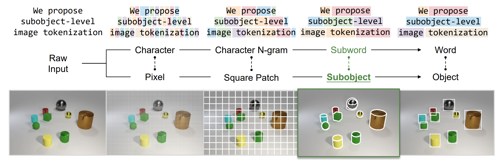
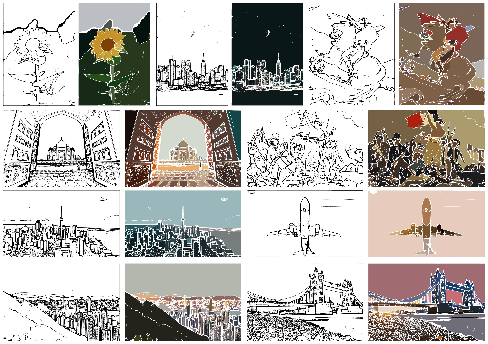
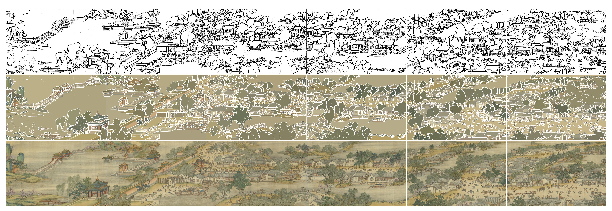
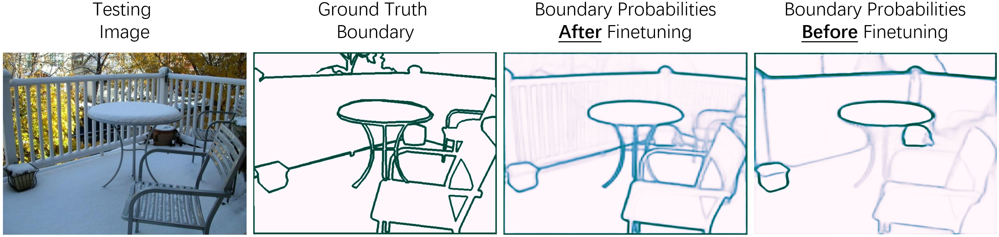

<div align="center">

## [Subobject-level Image Tokenization](https://arxiv.org/abs/2402.14327)

[Delong Chen (陈德龙)](https://chendelong.world/)
, &nbsp; 
[Samuel Cahyawijaya](https://samuelcahyawijaya.github.io/)
, &nbsp; 
[Jianfeng Liu (刘剑锋)](https://www.linkedin.com/in/jianfeng-liu-9539897b/) 
, &nbsp; 

[Baoyuan Wang (王宝元)](https://sites.google.com/site/zjuwby/)
, &nbsp; 
[Pascale Fung](https://pascale.home.ece.ust.hk/)
 &nbsp; 

 Hong Kong University of Science and Technology &nbsp; &nbsp; 
 Xiaobing.AI


<!-- [[arXiv]](https://arxiv.org/abs/2402.14327)&nbsp;|&nbsp;
[[Github]](https://github.com/ChenDelong1999/subobjects) -->

</div>




## Updates
- **2024/04/24**: We updated our paper with the Direct Segment Anything Model (DirectSAM), which efficiently generates comprehensive subobject segmentations with a single forward pass! Checkout our latest arXiv ([2402.14327v2](https://arxiv.org/abs/2402.14327v2)) and 🎬Demo Video on [YouTube](https://www.youtube.com/watch?v=tlNs7xUQ0x4) or [bilibili](https://www.bilibili.com/video/BV1yH4y1A7V3/). The pretrained DirectSAM model is released on HuggingFace: 🤗[DirectSAM-1800px-0424](https://huggingface.co/chendelong/DirectSAM-1800px-0424), and the training code is also available in this repo!

- **2024/02/23**: Our paper is featured in AK's 🤗[Huggingface Daily Papers](https://huggingface.co/papers/2402.14327).

- **2024/02/22**: The first version of our paper is released on arXiv ([2402.14327](https://arxiv.org/abs/2402.14327)). Codes and models will be open-sourced at this repository.


## Direct Segment Anything Model (DirectSAM)

<div align="center">

🎬[Demo Video (YouTube)](https://www.youtube.com/watch?v=tlNs7xUQ0x4) | 🎬[Demo Video (bilibili)](https://www.bilibili.com/video/BV1yH4y1A7V3) | 🤗[DirectSAM-1800px-0424](https://huggingface.co/chendelong/DirectSAM-1800px-0424)

</div>







### Using DirectSAM

- Clone the repository 

    ```bash
    git clone https://github.com/ChenDelong1999/subobjects.git
    cd subobjects
    ```

- Install dependencies

    ```bash
    conda create -n subobjects python=3.11 -y
    conda activate subobjects
    pip install -r requirements.txt
    ```

- Run DirectSAM on an example image

    ```python
    import requests
    from PIL import Image
    from transformers import AutoModelForSemanticSegmentation, AutoImageProcessor
    from utils import inference_single_image, visualize_direct_sam_result

    checkpoint = "chendelong/DirectSAM-1800px-0424"

    image_processor = AutoImageProcessor.from_pretrained(checkpoint, reduce_labels=True)
    model = AutoModelForSemanticSegmentation.from_pretrained(checkpoint).to('cuda').eval()

    url = "http://images.cocodataset.org/val2017/000000002149.jpg"
    image = Image.open(requests.get(url, stream=True).raw).convert("RGB")

    probs = inference_single_image(image, image_processor, model, resolution=None, pyramid_layers=0)
    visualize_direct_sam_result(probs, image, threshold=0.25)
    ```

The `probs` is the predicted boundary probabilities of the image, which is an ndarray of shape (height, width) between 0 and 1. The `visualize_direct_sam_result` function will show visualizations using `matplotlib`, where the `threshold` controls the binarization of the boundary probabilities.

Quality of segmentation can be improved by increasing the input resolution and the number of pyramid layers. The above two groups of figures are generated using `resolution=3600`, `pyramid_layers=1`/`pyramid_layers=2`, and `threshold=0.03`.

Using half-precision `model.half()` can speed up the inference and reduce the GPU memory requirement.

### Training DirectSAM

We provide an example script to fine-tune DirectSAM on the [ADE20K dataset](https://huggingface.co/datasets/scene_parse_150). The implementation is based on 🤗 HuggingFace Trainer, please see [this blog](https://huggingface.co/docs/transformers/tasks/semantic_segmentation) for a detailed tutorial.

The following command will start a distributed training with 512x512 resolution input and half-precision training, which takes around 9GB memory per GPU. 

```bash
cd DirectSAM
CUDA_VISIBLE_DEVICES=0,1,2,3 torchrun --nproc_per_node 4 trainer.py
```

The following figures compare the segmentation results of DirectSAM before and after the above finetuning on ADE20K.




### Citation

If you find this work useful, please consider citing:

```bibtex
@article{chen2024subobject,
  author       = {Delong Chen and
                  Samuel Cahyawijaya and
                  Jianfeng Liu and
                  Baoyuan Wang and
                  Pascale Fung},
  title        = {Subobject-level Image Tokenization},
  journal      = {CoRR},
  volume       = {abs/2402.14327},
  year         = {2024},
  url          = {https://doi.org/10.48550/arXiv.2402.14327},
  doi          = {10.48550/ARXIV.2402.14327},
  eprinttype    = {arXiv},
  eprint       = {2402.14327}
}
```
